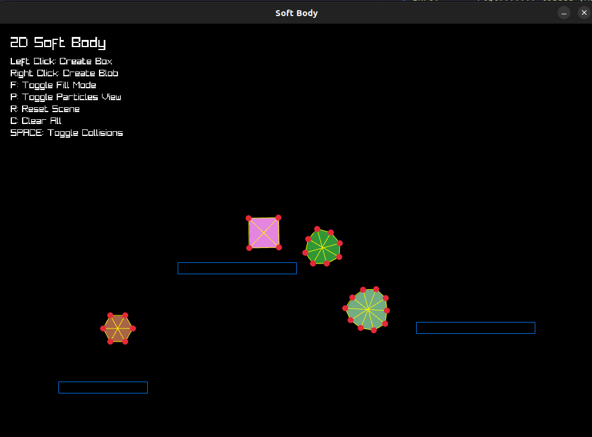

# soft Body Physics
> A 2D Soft Body Physics Engine, Built with **C++** and **Raylib**.





## Installation

### Linux:
Make sure the following are installed:
- raylib
- A compiler (like gcc) 

then run:

```sh
bash build.bash
```

Or download the pre-built version from itch.io [here](https://shahd-moh-abdel.itch.io/soft-body).

### Windows:
install
- raylib 
- A C compiler 
then compile using your preferred method.

## Tech stack
- Raylib
- C++

## Controls
- Left Click: Create a soft box at mouse position
- Right Click: Create a soft blob at mouse position
- F: Toggle between filled shapes and wireframe view
- P: Toggle particle and constraint visualization
- R: Reset to demo scene with obstacles
- C: Clear all objects
- SPACE: Toggle particle-to-particle collisions
- H: Show/hide help

## Warning
 The collision system works great for normal interactions, but if objects get stuck, they might not escape :) It's designed for external collisions rather than internal recovery
 
## Read More
You Can read more about soft body physics in this [paper](https://www.cs.cmu.edu/afs/cs/academic/class/15462-s13/www/lec_slides/Jakobsen.pdf).

## Contributing

Fork it, create your feature branch, commit your changes, push to the branch, create a new pull request. 

[](https://award.athena.hackclub.com?utm_source=readme)

